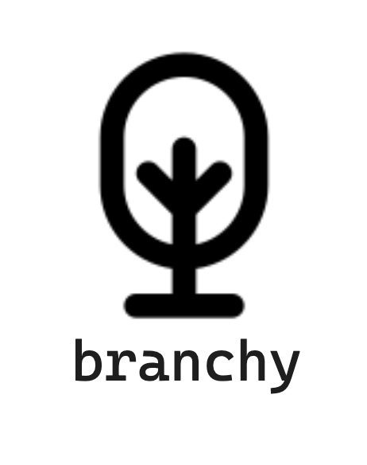

A VSCode extension that helps you keep track of your working files based on the feature branch you're currently in.

### What made me build this?

In my daily work, I keep switching branches while working back and forth between features/issues, so I keep closing/opening tabs and it becomes a bit tedious. Usually when I open up a branch, I have no idea which files was I working with because my current vscode window is cluttered with all the files from across tons of branches.

### How does branchy solve this problem?

*branchy* helps you build that isolation level on top of your current workspace that allows you to
peacefully navigate through the exploration phase and the implementation phase when working 
across different features at the same time.

